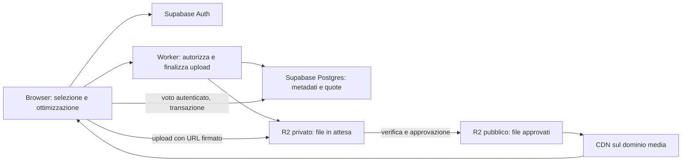

# UNSEEN: piano per media e crescita

Proposta del 6 ottobre 2026 per migliaia di utenti totali/mensili. Questo documento descrive una migrazione da realizzare: non configura account cloud e non modifica il backend attualmente online.

## Scelta consigliata

Mantenere Supabase Postgres e Auth per utenti, opere, brani, duelli, moderazione e voti. Spostare i file su Cloudflare R2 Standard. Conservare inizialmente Vercel per il frontend React/Vite; valutare Cloudflare Pages separatamente.

R2 è uno storage a oggetti, non il database transazionale di utenti e voti. Un unico database relazionale permette di mantenere vincoli e transazioni senza sincronizzare più database. Separare i file elimina molta occupazione dello storage e traffico media su Supabase, ma non aumenta automaticamente la potenza del database.

Il frontend continua a usare le RPC protette per votare. L'API di upload verifica la sessione Supabase. La lettura pubblica del duello può essere servita da una risposta condivisa in cache; il voto personale deve rimanere separato.

## Stato del codice esaminato

- `src/components/InviaOpera.tsx` ridimensiona già le fotografie a un massimo di 2400 pixel e prova WebP a qualità 0,88. Se la conversione fallisce o produce un file più grande, carica l'originale. Non produce miniature separate. Il limite in ingresso è 5 MB.
- `src/components/InviaBrano.tsx` carica cover e audio interi su Supabase Storage. La validazione consente cover fino a 5 MB e MP3/WAV fino a 30 MB; non esiste ancora il selettore dell'estratto.
- Le tabelle musicali conservano URL completi; conviene introdurre riferimenti agli oggetti senza rompere subito i dati esistenti.
- La pagina fotografica chiama `activate_scheduled_duel` durante il caricamento dell'arena principale. La programmazione dei duelli dovrebbe essere un compito periodico o una selezione basata sugli orari, non una mutazione richiesta dai visitatori.
- Lo script locale `supabase/rls-policies.sql` permette upload fotografici anonimi. Prima della crescita va sostituito con un percorso controllato, con quote e autorizzazione. Non è stata verificata l'applicazione di questo script al progetto remoto.
- La RPC musicale impedisce il doppio voto e aggiorna i contatori nella stessa transazione, bloccando la riga del duello. Mantenere questa correttezza; misurare la contesa solo quando il traffico lo richiede.
- Anche le immagini demo e le texture statiche in `public/music` pesano diversi MB: vanno ottimizzate una volta, verificando la resa delle copertine e del vinile.

## Formati e dimensioni obiettivo

| Contenuto | Proposta iniziale | Peso indicativo, da misurare |
| --- | --- | --- |
| Fotografia per arena | WebP, lato lungo 1920–2400 px, proporzioni originali | 250–700 KB |
| Miniatura fotografia | WebP, lato lungo 480 px | 30–80 KB |
| Cover musicale | WebP, fino a 1024 px | 150–300 KB |
| Miniatura cover | WebP, fino a 320 px | 20–60 KB |
| Estratto musicale | MP3 stereo 128 kbit/s, 30 oppure 40 secondi | circa 480 oppure 640 KB |

Sono obiettivi, non dimensioni garantite: una fotografia ricca di dettagli può pesare di più. Verificare qualità su immagini reali, gestione dell'orientamento e dei colori. Non tagliare tutte le fotografie in quadrato: la custodia può usare un ritaglio di presentazione, mentre il file fotografico mantiene le proporzioni.

Per una gara equa, scegliere una durata comune per tutti i partecipanti della stessa competizione. L'autore sceglie il punto iniziale della propria traccia, ascolta l'anteprima e conferma. Salvare `clip_start_ms`, `clip_duration_ms` e, se utile, la durata dichiarata dell'originale.

Il file originale viene selezionato localmente, ritagliato e ricodificato; si invia soltanto l'estratto. Inviare tutta la canzone e limitarne la riproduzione a 40 secondi non riduce lo spazio occupato. Anche un WAV di 40 secondi resta molto più grande di un MP3 compresso.

Il taglio/encoding nel browser richiede una libreria o codec compatibile, e prove su Safari/iPhone e dispositivi con poca memoria. Per file troppo grandi prevedere un limite di ingresso e la possibilità di caricare un estratto già preparato. Se serve una conversione server affidabile per qualunque sorgente, introdurre un processo FFmpeg separato con un costo misurato: non progettare un transcoder pesante dentro un Worker Free. Il piano gratuito ha 10 ms di CPU per invocazione. [Documentazione Workers](https://developers.cloudflare.com/workers/platform/pricing/).

## Organizzazione dei dati

Estendere lo schema attuale per gradi, mantenendo i due tipi di arena e i loro voti durante la migrazione.

| Tabelle | Responsabilità |
| --- | --- |
| `auth.users`, `profiles` | Identità e profilo; i ruoli di moderazione devono essere amministrati dal server |
| `opere` | Titolo, autore, storia, proprietario, stato e riferimenti alle immagini |
| `music_tracks` | Titolo, artista, proprietario, stato, riferimenti a cover/audio e informazioni sull'estratto |
| `duels`, `music_duels` | Partecipanti, inizio/fine, stato e contatori |
| `votes`, `music_votes` | Voti individuali; vincolo unico utente + duello |
| Nuova `media_assets` | Un record per file: proprietario, provider, bucket, object key, MIME, byte, dimensioni/durata verificate, stato |
| Nuova `upload_sessions` | Prenotazione della quota, oggetti attesi, scadenza e stato della finalizzazione |

Nei record delle opere e dei brani usare foreign key agli asset. Esempio di object key: `users/<uuid>/tracks/<uuid>/clip-v1.mp3`. Gli URL vengono costruiti dalla configurazione del dominio media. Non memorizzare file binari o base64 nel database, né URL firmati che scadono.

Gli stati degli asset possono essere `uploading`, `pending`, `ready`, `rejected`, `deleted`. Un asset `ready` deve avere verifiche completate e un riferimento pubblicabile. Gli utenti possono inviare propri contenuti in attesa, ma non approvarli o impostare liberamente i byte verificati. Le letture pubbliche espongono solo contenuti approvati.

Gli indici da valutare sulle query effettive sono: moderazione `(status, created_at)`, elenco personale `(user_id, created_at)`, duello attivo e `duel_id` nei voti per conteggi/audit. Il vincolo unico `(user_id, duel_id)` già presente è indispensabile e non equivale a un indice ottimale per cercare tutti i voti di un duello. Verificare i piani delle query; troppi indici consumano spazio e rallentano le scritture.

Paginare galleria e amministrazione e selezionare solo i campi necessari. Monitorare spazio delle tabelle e degli indici: separare i media non impedisce ai voti di riempire i 500 MB del piano gratuito. Conservare i totali storici e definire esplicitamente quali voti dettagliati mantenere; non eliminare lo storico necessario per verificare i risultati senza una politica e un archivio.

## Configurazione realizzata

Il collegamento R2 è ora applicato. La funzione Supabase `r2-media` gestisce le richieste JSON di preparazione/conferma e la moderazione; i file viaggiano direttamente dal browser a R2. Il Worker Cloudflare serve i file approvati ed esegue la pulizia periodica. Percorsi, limiti, verifiche e differenze rispetto alle proposte seguenti sono descritti in [R2.md](./R2.md).

L'implementazione attuale verifica dimensione, MIME e firma iniziale del formato, con upload firmati vincolati ai byte. Non verifica ancora la durata né converte l'audio in estratti. Gli upload incompleti scadono; i rifiutati sono conservati privatamente fino all'eliminazione da parte dell'admin. I file precedenti non sono stati migrati.

## Flusso di caricamento R2 proposto

1. Il browser prepara i file ottimizzati e mostra dimensione/anteprima.
2. `POST /uploads/prepare` verifica il token Supabase, l'identità, il numero di invii ammessi e la quota di byte. Prenota quota e object key sul server, con scadenza.
3. L'API genera URL firmati brevi per i singoli oggetti nel bucket privato. Il browser carica direttamente su R2, senza far passare i file da Vercel. Configurare CORS sull'endpoint S3. [URL firmati R2](https://developers.cloudflare.com/r2/api/s3/presigned-urls/).
4. `POST /uploads/finalize` verifica sessione/proprietario e file effettivi, dimensioni, formato e durata, poi registra la candidatura. La verifica del solo nome/MIME dichiarato non basta. `HEAD` conferma i byte, ma non prova che l'audio duri 40 secondi: serve un parser del formato o un processo di validazione.
5. La moderazione approva il contenuto; solo gli oggetti validati vengono copiati nel bucket pubblico e collegati agli asset pubblicati.
6. Un compito periodico elimina upload scaduti e file orfani; i rifiutati vengono eliminati dopo una finestra concordata, per esempio 7 giorni dalla decisione.

Un URL firmato da solo non è un sistema di quote: le prenotazioni devono essere atomiche e i limiti reali vanno verificati. La pulizia dopo l'upload riduce l'accumulo, ma non evita ogni trasferimento abusivo; per un limite rigido sulla dimensione in ingresso valutare un endpoint di upload controllato. Non mettere chiavi R2 o la service role Supabase in variabili frontend `VITE_*`.

Per distribuire file approvati usare un dominio come `media.<dominio-del-progetto>` collegato al bucket pubblico, con cache configurata. `r2.dev` è destinato allo sviluppo. Usare object key versionate e cache lunga per file immutabili; invalidare la cache quando viene rimosso un contenuto. [Bucket pubblici e cache](https://developers.cloudflare.com/r2/buckets/public-buckets/).

L'audio deve mantenere CORS compatibile con `crossOrigin="anonymous"` e con l'analizzatore Web Audio già usato dal progetto. Verificare anche richieste Range, seek e riproduzione mobile. Evitare il download completo dei due brani prima del Play.

## Letture, voti e picchi

Servire la scheda pubblica dell'arena con cache breve, per esempio 15–30 secondi, aggiornandola alla partenza/fine del duello. Non condividere nella cache sessioni, bozze, dati privati o voto personale. La RPC verifica sempre l'orario sul server, anche se una scheda in cache è momentaneamente vecchia.

Il countdown è locale. Non fare una query al secondo per ogni spettatore. Per i contatori basta spesso un aggiornamento meno frequente; il risultato ufficiale deriva dai voti confermati nel database. Una risposta pubblica JSON pre-generata su R2/CDN può ridurre ulteriormente le letture del database. La cache di un Worker riduce il lavoro del backend, ma le richieste al Worker continuano a contare nella sua quota. [Prezzi Workers](https://developers.cloudflare.com/workers/platform/pricing/).

Per il traffico mensile indicato, mantenere inizialmente la transazione di voto attuale e provarla con un carico rappresentativo. Se i picchi sullo stesso duello causano attese, valutare inserimento dei voti con vincolo unico e aggregazione periodica o contatori distribuiti. Ciò richiede progettare correttamente chiusura del duello e risultato finale; non sostituire il voto con incrementi fatti dal browser.

## Gratuità e dimensionamento

Supabase Free include 500 MB di database, 1 GB di file storage, 50.000 utenti attivi mensili Auth e quote distinte di 5 GB di egress e 5 GB di cached egress. Compute condiviso e pausa per inattività restano limiti separati. Questi numeri non promettono una capacità di utenti simultanei. [Prezzi Supabase](https://supabase.com/pricing).

R2 Standard include 10 GB-mese, 1 milione di operazioni Class A e 10 milioni Class B al mese; il trasferimento in uscita R2 non è tariffato. Oltre le quote si paga consumo: il piano gratuito non significa spazio illimitato. [Prezzi R2](https://developers.cloudflare.com/r2/pricing/).

Esempio illustrativo in MB decimali: 5.000 brani con estratto da 640 KB, cover da 250 KB e miniatura da 50 KB occupano circa 4,7 GB. Altre 5.000 fotografie da 350 KB complessivi occupano 1,75 GB: totale circa 6,45 GB. Sono contenuti conservati complessivamente, non un nuovo contingente gratuito ogni mese; non comprende originali, backup e altri asset. Misurare i pesi reali prima di imporre quote.

Con 100 GB-mese Standard, la sola componente storage oltre i 10 inclusi è circa 1,35 USD/mese; operazioni e altri servizi sono separati. È una stima, non un preventivo complessivo. [Tariffe R2](https://developers.cloudflare.com/r2/pricing/).

Cloudflare Pages offre richieste statiche gratuite senza limite numerico indicato; le Functions condividono la quota giornaliera dei Workers, non sono illimitate. Può ospitare il frontend Vite con build `npm run build`, output `dist`, routing SPA e variabili/configurazione verificate. [Prezzi Pages](https://developers.cloudflare.com/pages/functions/pricing/).

Vercel Hobby è riservato a uso personale non commerciale. Se UNSEEN diventa commerciale, scegliere un hosting/piano compatibile prima di basarsi sul costo zero. [Condizioni Hobby](https://vercel.com/docs/plans/hobby).

Cloudflare D1 è un'alternativa futura, non necessaria per spostare i file: Free include 5 milioni di righe lette e 100.000 scritte al giorno, con 5 GB complessivi, ma un singolo database Free arriva a 500 MB. Richiede adattare lo schema PostgreSQL, RPC, permessi e integrazione Auth. Non raccomando questa riscrittura prima di misurare un limite reale. [Prezzi D1](https://developers.cloudflare.com/d1/platform/pricing/), [limiti D1](https://developers.cloudflare.com/d1/platform/limits/).

Per le registrazioni via email serve SMTP configurato per produzione: quello predefinito Supabase è limitato agli indirizzi del team e attualmente a due messaggi l'ora. Un servizio email esterno ha quote proprie. [SMTP Supabase](https://supabase.com/docs/guides/auth/auth-smtp).

## Ordine di realizzazione e verifica

1. Misurare dashboard attuali: spazio media/DB, traffico, invii giornalieri, voti al secondo nei picchi, durata delle query. Decidere conservazione, durata comune dell'estratto e quota per autore.
2. Realizzare selettore dell'estratto e ottimizzazione cover/foto con miniature; verificare qualità e compatibilità mobile prima della migrazione storage.
3. Aggiungere asset e sessioni upload con una migrazione compatibile; mantenere gli URL esistenti per leggere i contenuti precedenti.
4. Configurare bucket R2 privato/pubblico, dominio media e Worker con segreti server. Integrare prepare/finalize e pubblicazione moderata. Provare doppia finalizzazione, scadenza, file errati e pulizia.
5. Copiare i media esistenti a lotti, controllare integrità e aggiornare i riferimenti. Tenere temporaneamente la lettura precedente per rollback. Solo dopo la verifica rimuovere le copie obsolete, secondo la politica di conservazione.
6. Introdurre cache pubblica e programmazione dei duelli; verificare voto doppio, confine di scadenza e contatori sotto carico. Controllare query/RLS e piani degli indici.
7. Registrare consumi e soglie di allarme, per esempio 70% e 90% delle quote. Se il budget deve restare esattamente zero, bloccare nuovi upload prima dell'esaurimento, tenendo margine per letture e operazioni; gli allarmi non sono un tetto di spesa automatico.

Obiettivo: molte visite servite dalla CDN, file piccoli, poche query utili e scritture corrette. Migliaia di utenti mensili possono essere compatibili con quote gratuite, ma la conferma dipende da attività reale, accumulo dei contenuti e picchi di voto.
